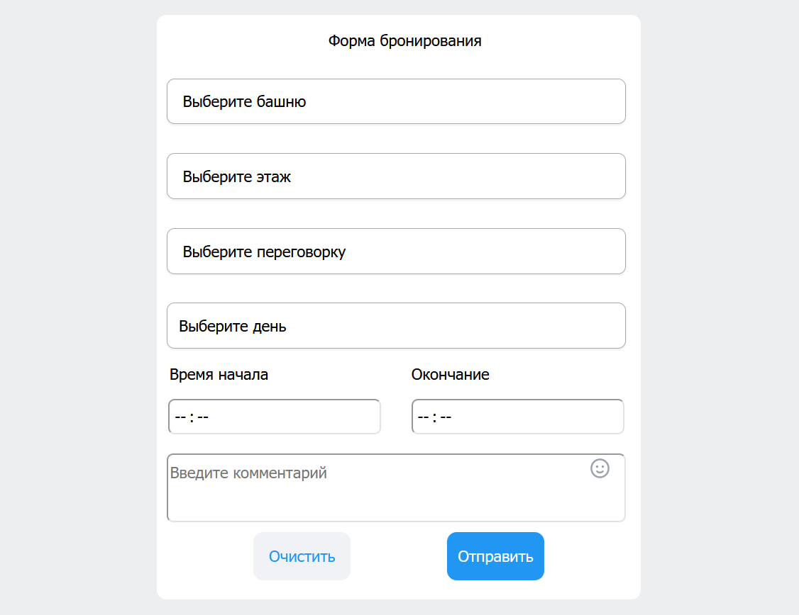
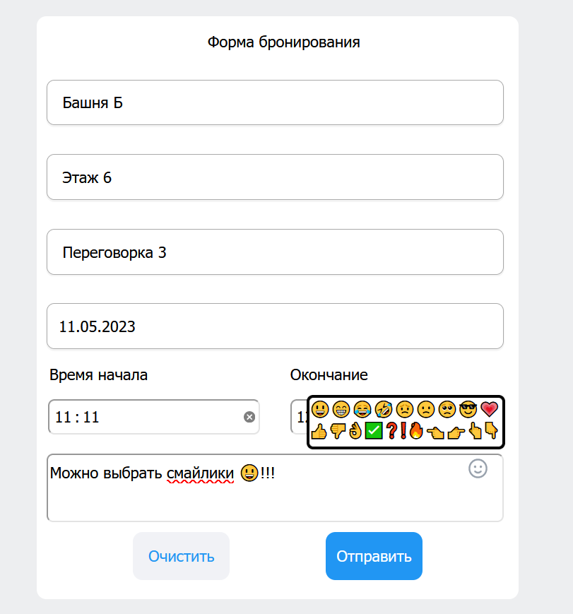

# Booking Form
Веб-приложение представляет собой форму бронирования переговорной

Результат: https://vk-internship-nghc.vercel.app

> Приложение написано с помощью HTML, CSS, JavaScript. Без применения фреймворков.

# Предварительный просмотр

# Особенности
- При нажатии на смайлик в комментарии ввода справа открывается выпадающий интерфейс выбора смайлика для вставки в поле комментария
- Можно выделить часть текста и заменить на выбранный смайлик
- Можно вставить смайлик на любую позиции в комментарии
- Время можно не только выбирать, но и вводить с клавиатуры
- Если не выбраны обязательные элементы (этаж, переговорная комната, дата и время), то не заполненные элементы подсветятся красным
- Время начала встречи всегда раньше времени окончания, нельзя назначить время на прошлую дату

# Задание

Форма должна содержать следующие элементы:

- выпадающий список с выбором башни (А или Б)
- выпадающий список с выбором этажа (с 3 по 27)
- выпадающий список с выбором переговорки. На каждом этаже 10 переговорок
- выбор даты и интервала времени (в произвольном виде, например выпадающие списки, data-
  picker)
- поле ввода комментария (textarea)
- кнопка "Отправить" (по нажатию - выводить в консоль данные формы в виде json)
- кнопка "Очистить" (по нажатию очищает форму)

Код необходимо писать либо на чистом JavaScript, либо с использованием React.

При выполнении задания можно пользоваться готовыми библиотеками компонентов, в верстке
желательно использовать флексбоксы.

# Управление с клавиатуры
  - Ввод выбора времени
  - Tab - переход между объектами
  - Enter - подтвердить выбор
  - Стрелки (вверх, вниз) - выбор башни, этажа, переговорной комнаты
  - Esc - закрыть выбор смайликов
 
# Результат

https://vk-internship-nghc.vercel.app
